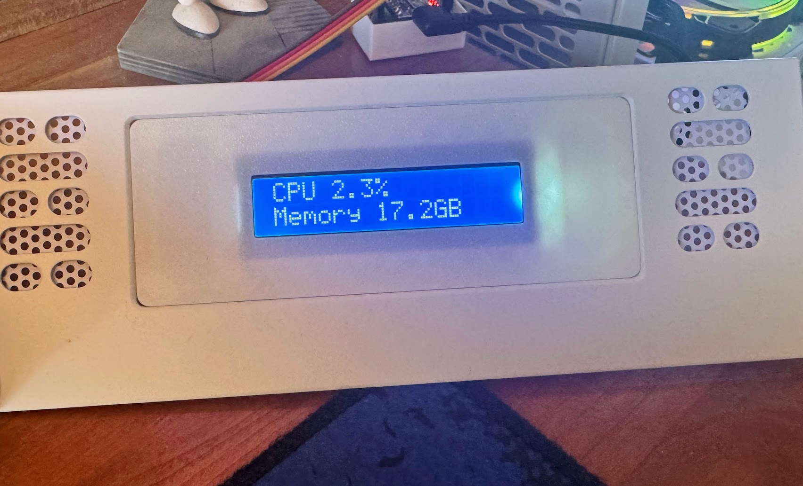
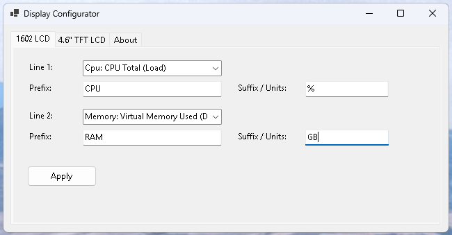

# LCD Display Configurator

A Windows-based configuration utility and background service for customizing text output on ESP32-connected displays such as a 1602 LCD or a 4.6" TFT screen.



---

## 📦 Features

- 🔌 Communicates with ESP32 over USB serial
- 📊 Displays real-time system metrics (CPU, RAM, etc.)
- ⚙️ Full GUI configurator with support for:
  - 1602 LCD
  - 4.6" TFT LCD (placeholder for future)
- 📁 Config stored in AppData (shared between GUI and background service)
- 🔄 Windows service auto-starts and auto-recovers on crash
- 💡 Modular and future-proof design for multiple display types

---

## 🖥️ Configuration UI

The WinForms-based configuration tool allows you to:

- Select system metrics using a dropdown populated from LibreHardwareMonitor
- Customize line prefixes (e.g., `CPU: `) and suffixes (e.g., `%`, `°C`)
- Configure different screen types via tabbed interface

### 🔧 1602 LCD Tab

- Line-by-line customization
- Metric + prefix/suffix control
- Saves to shared config file in AppData

> 

---

### 📺 4.6" TFT LCD Tab

- Coming soon! Layout planned for graphical display customization

---

### ℹ️ About Tab

Displays app info, version, and author attribution.

---

## 🛠️ Windows Background Service

- Continuously reads system metrics
- Sends output to ESP32-connected LCD
- Detects connected COM port automatically
- Reloads config when `config.json` changes
- Auto-recovers if the service crashes

### Service Config Example:

```json
{
  "ScreenType": "1602",
  "Line1Selection": "Cpu: CPU Total (Load)",
  "Line1CustomText": "CPU: ",
  "Line1PostText": "%",
  "Line2Selection": "Memory: Used Memory (Data)",
  "Line2CustomText": "RAM: ",
  "Line2PostText": " GB"
}
```

---

## 📂 Config File Location

The config file is shared between the UI and service and stored here:

```
%AppData%\PCPal\config.json
```

---

## 📦 Installation

1. **Clone the repo**
2. Build both projects:  
   - `DisplayConfigurator` (WinForms app)  
   - `ESP32BackgroundService` (Worker service)
3. Publish the service and install via `sc.exe` or PowerShell
4. Run the configurator to apply your settings

---

## 🧪 Development

- Built using `.NET 6+`
- Uses:
  - [`LibreHardwareMonitorLib`](https://github.com/LibreHardwareMonitor/LibreHardwareMonitor)
  - `Newtonsoft.Json`
  - `System.IO.Ports`

---

## 🧰 Tools & Commands

### Install the Service:
```powershell
sc create ESP32BackgroundService binPath= "C:\Path\To\ESP32BackgroundService.exe"
sc failure ESP32BackgroundService reset= 0 actions= restart/5000
```

### Uninstall the Service:
```powershell
sc stop ESP32BackgroundService
sc delete ESP32BackgroundService
```

---

## 📄 License

MIT License  
© 2025 Christopher Koch aka, NinjaPug
